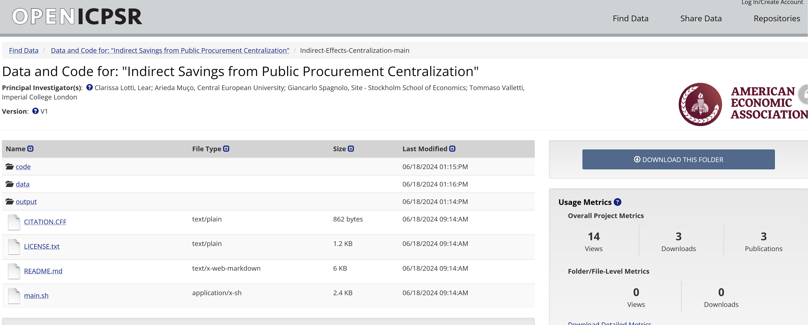

# Reproducibility and Undergraduate Training

**Richard Ball** asked the (rhetorical) question "Is it feasible to include reproducible research methods in undergraduate training?"  [@ballYesWeCan2023], answering that question with **"Yes we can!"**. 

I will go beyond that, and argue **"Yes we should!"**

## Why?

- As of August 2024, the LDI Replication Lab has verified **around 2500** distinct AEA journal manuscripts as to their computational reproducibility. [@10.1257/pandp.114.878]
- Since 2014 (starting before the official AEA work), **more than 200 undergraduates** have been trained, and have helped in the assessment.
- The training is not part of a regular (Cornell) curriculum.

## What is a replication package?

- [AEA Data and Code Availability policy](https://www.aeaweb.org/journals/data/data-code-policy)
- [Data and Code Availability Standard](https://datacodestandard.org/)  
- [AEA Data and Code Repository](https://www.openicpsr.org/openicpsr/search/aea/studies)

---

---

## What do the students do?

- Analyze **data provenance** as described by authors
- Verify **ability to computationally reproduce** results
- **Attempt reproduction** as per instructions (README)
- Inevitably **debug**
- Write a **shareable report**

## How are the students trained?

::: {.multicolumn}
:::: {.col}

[@vilhuberTeachingLargescaleReproducibility2022]

- Intense 1-day training on principles and technology
- Loose follow-up on three examples
- Then **real** cases.

::::
:::: {.col}

::::
:::
## Why are students trained?

- Reproducibility verification

# Goal

- [ ] Illustrate principles of reproducible research from the start
- [ ] Stay reasonably close to an ideal reproducibility Standard
- [ ] Use tools that are widely available and easy to use
